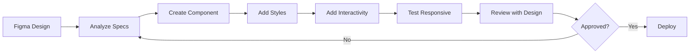

# Design-to-Code Workflow Guide

## Overview
This document outlines the complete workflow for translating Figma designs into production code using Cursor and Figma MCP integration.

## Table of Contents
1. [Setup & Prerequisites](#setup--prerequisites)
2. [Design Handoff Process](#design-handoff-process)
3. [Development Workflow](#development-workflow)
4. [Component Development](#component-development)
5. [Review & Iteration](#review--iteration)
6. [Deployment Checklist](#deployment-checklist)

## Setup & Prerequisites

### 1. Environment Setup
```bash
# Initial setup checklist
- [ ] Figma MCP connected and authenticated
- [ ] Cursor configured with project rules
- [ ] Design tokens exported from Figma
- [ ] Tailwind config synced with design system
- [ ] TypeScript strict mode enabled
- [ ] ESLint and Prettier configured
```

### 2. Figma Access Setup
```javascript
// .env.local
FIGMA_ACCESS_TOKEN=your_token_here
FIGMA_FILE_ID=your_file_id_here
FIGMA_TEAM_ID=your_team_id_here
```

### 3. Design System Sync
```javascript
// tailwind.config.js
module.exports = {
  theme: {
    extend: {
      colors: {
        // Import from Figma variables
        primary: 'var(--color-primary)',
        secondary: 'var(--color-secondary)',
      },
      spacing: {
        // Match Figma spacing system
        'xs': 'var(--space-xs)',
        'sm': 'var(--space-sm)',
        'md': 'var(--space-md)',
        'lg': 'var(--space-lg)',
        'xl': 'var(--space-xl)',
      }
    }
  }
}
```

## Design Handoff Process

### 1. Pre-Development Checklist
```markdown
Before starting development, ensure:

Design Completeness:
- [ ] All states designed (default, hover, active, disabled)
- [ ] Responsive layouts defined (mobile, tablet, desktop)
- [ ] Dark mode variants (if applicable)
- [ ] Micro-interactions documented
- [ ] Content guidelines provided

Asset Preparation:
- [ ] Icons exported as SVG
- [ ] Images optimized and exported at 2x
- [ ] Fonts identified and licensed
- [ ] Color palette documented
- [ ] Spacing system defined
```

### 2. Figma Inspection Workflow
```
1. Open Figma file
2. Navigate to specific frame/component
3. Use Dev Mode for accurate specs
4. Copy CSS/values directly when possible
5. Note any animations or transitions
6. Check component variants
7. Document any ambiguities
```

### 3. Design Token Extraction
```typescript
// lib/design-tokens.ts
export const tokens = {
  colors: {
    primary: '#3B82F6',      // Figma: Primary/500
    primaryHover: '#2563EB', // Figma: Primary/600
    // ... map all Figma colors
  },
  typography: {
    headingXL: {
      fontSize: '48px',      // Figma: Heading/XL
      lineHeight: '56px',
      fontWeight: 700,
    },
    // ... map all text styles
  },
  spacing: {
    xs: '4px',   // Figma: Spacing/XS
    sm: '8px',   // Figma: Spacing/SM
    md: '16px',  // Figma: Spacing/MD
    lg: '24px',  // Figma: Spacing/LG
    xl: '32px',  // Figma: Spacing/XL
    // ... complete spacing scale
  }
}
```

## Development Workflow

### 1. Component Planning Phase
```markdown
For each new component:

1. **Identify Component Type**
   - Layout component? → `/components/layout/`
   - Page section? → `/components/sections/`
   - Reusable UI? → `/components/ui/`

2. **Analyze Requirements**
   - Props needed
   - State management
   - Data dependencies
   - Animation requirements
   - Responsive behavior

3. **Create Component Structure**
   ```
   ComponentName/
     index.tsx           // Main component
     ComponentName.types.ts  // TypeScript interfaces
     ComponentName.test.tsx  // Tests
     README.md          // Documentation
   ```
```

### 2. Implementation Flow


### 3. Cursor AI Prompting Strategy
```markdown
## Effective Prompts for Cursor

### Component Creation
"Create a [ComponentName] component based on the Figma design at [Frame Name].
- Use these exact specifications: [paste Figma specs]
- Include hover state with [description]
- Make responsive with breakpoints at md: and lg:
- Add TypeScript props interface
- Include accessibility attributes"

### Style Implementation
"Update the [ComponentName] styling to match Figma:
- Desktop: [Figma desktop specs]
- Tablet: [Figma tablet specs]  
- Mobile: [Figma mobile specs]
- Use only Tailwind classes, no arbitrary values
- Maintain design token consistency"

### Bug Fixing
"Fix the [issue description] in [ComponentName].
The Figma design shows [expected behavior].
Currently it [current behavior].
Maintain all existing functionality while fixing."
```

## Component Development

### 1. File Structure Template
```typescript
// components/sections/HeroSection/index.tsx
import { HeroSectionProps } from './HeroSection.types'

/**
 * HeroSection Component
 * Figma: Homepage / Hero Section
 * 
 * Main hero section with headline, subtitle, and CTA
 */
export default function HeroSection({
  headline,
  subtitle,
  ctaText,
  ctaLink
}: HeroSectionProps) {
  return (
    <section className="
      /* Mobile First */
      px-4 py-12
      /* Tablet */
      md:px-6 md:py-16
      /* Desktop */
      lg:px-8 lg:py-20
    ">
      {/* Component implementation */}
    </section>
  )
}
```

### 2. Progressive Enhancement
```typescript
// Step 1: Static Structure
<div className="container">
  <h1>Heading</h1>
  <p>Content</p>
</div>

// Step 2: Add Styling
<div className="container mx-auto px-4">
  <h1 className="text-4xl font-bold">Heading</h1>
  <p className="text-gray-600">Content</p>
</div>

// Step 3: Add Responsive
<div className="container mx-auto px-4 md:px-6 lg:px-8">
  <h1 className="text-3xl md:text-4xl lg:text-5xl font-bold">
    Heading
  </h1>
  <p className="text-sm md:text-base lg:text-lg text-gray-600">
    Content
  </p>
</div>

// Step 4: Add Interactivity
// ... add states, animations, handlers
```

### 3. Component Documentation
```markdown
# ComponentName

## Overview
Brief description matching Figma component description

## Figma Reference
- File: [Figma File Name]
- Page: [Page Name]
- Frame: [Frame Name]
- Last Updated: [Date]

## Props
| Prop | Type | Required | Default | Description |
|------|------|----------|---------|-------------|
| title | string | yes | - | Main heading text |
| subtitle | string | no | - | Supporting text |

## Usage
\```tsx
<ComponentName
  title="Welcome"
  subtitle="Get started"
/>
\```

## Variants
- Default: Standard appearance
- Dark: Dark mode variant
- Compact: Reduced spacing variant

## Responsive Behavior
- Mobile (<768px): Stacked layout, 16px padding
- Tablet (768px-1024px): 2-column, 24px padding  
- Desktop (>1024px): 3-column, 32px padding
```

## Review & Iteration

### 1. Self-Review Checklist
```markdown
Before requesting design review:

Visual Accuracy:
- [ ] Matches Figma at all breakpoints
- [ ] Colors exactly match design tokens
- [ ] Spacing follows design system
- [ ] Typography is pixel-perfect
- [ ] Images are optimized

Functionality:
- [ ] All interactive states work
- [ ] Forms validate properly
- [ ] Error states display correctly
- [ ] Loading states implemented
- [ ] Animations are smooth

Code Quality:
- [ ] TypeScript has no errors
- [ ] ESLint passes
- [ ] No console.logs
- [ ] Components are documented
- [ ] Tests are passing
```

### 2. Design Review Process
```
1. Deploy to staging/preview
2. Share link with designer
3. Conduct side-by-side comparison with Figma
4. Document any discrepancies
5. Get written approval or change requests
6. Implement feedback
7. Re-review if needed
```

### 3. QA Testing Matrix
| Aspect | Mobile | Tablet | Desktop | Dark Mode |
|--------|--------|--------|---------|-----------|
| Layout | ✓ | ✓ | ✓ | ✓ |
| Typography | ✓ | ✓ | ✓ | ✓ |
| Spacing | ✓ | ✓ | ✓ | ✓ |
| Colors | ✓ | ✓ | ✓ | ✓ |
| Interactions | ✓ | ✓ | ✓ | ✓ |
| Performance | ✓ | ✓ | ✓ | ✓ |

## Deployment Checklist

### 1. Pre-Deployment
```markdown
Technical:
- [ ] Build passes without errors
- [ ] No TypeScript errors
- [ ] All tests passing
- [ ] Lighthouse score >90
- [ ] Bundle size acceptable

Design:
- [ ] Designer approved all components
- [ ] Responsive behavior verified
- [ ] Dark mode tested (if applicable)
- [ ] Animations perform well
- [ ] No visual regressions

Content:
- [ ] All text is final
- [ ] Images are optimized
- [ ] SEO meta tags added
- [ ] Analytics tracking added
- [ ] Error tracking configured
```

### 2. Deployment Steps
```bash
# 1. Final checks
npm run type-check
npm run lint
npm run test
npm run build

# 2. Preview deployment
npm run preview

# 3. Deploy to staging
git push origin feature/component-name

# 4. Deploy to production (after approval)
git checkout main
git merge feature/component-name
git push origin main
```

### 3. Post-Deployment
```markdown
Monitoring:
- [ ] Check error tracking for issues
- [ ] Monitor performance metrics
- [ ] Verify analytics are working
- [ ] Check responsive on real devices
- [ ] Test critical user paths

Documentation:
- [ ] Update component library
- [ ] Document any known issues
- [ ] Add to changelog
- [ ] Update design system if needed
- [ ] Notify team of changes
```

## Continuous Improvement

### 1. Feedback Loop
```
Design → Development → Testing → Review → Refinement
     ↑                                         ↓
     ←────────── Learning & Documentation ←────
```

### 2. Common Issues & Solutions

| Issue | Cause | Solution |
|-------|-------|----------|
| Spacing mismatch | Different box model | Use Dev Mode in Figma |
| Color variations | Color space differences | Use exact hex/rgb values |
| Font rendering | System font differences | Use web fonts consistently |
| Responsive gaps | Undefined breakpoints | Define all breakpoints in Figma |
| Animation jank | Unoptimized properties | Use transform/opacity only |

### 3. Best Practices Evolution
```markdown
Weekly Review:
- What worked well?
- What was challenging?
- What can be automated?
- What needs documentation?

Monthly Refinement:
- Update design tokens
- Refactor common patterns
- Improve tooling
- Update documentation
```

## Quick Reference

### Figma Shortcuts
- `Cmd/Ctrl + Click`: Select layer
- `Option/Alt`: Show distances
- `Cmd/Ctrl + Shift + C`: Copy properties
- Dev Mode: Toggle for specs

### Cursor Commands
- `Cmd + K`: Quick actions
- `Cmd + L`: AI chat
- `Cmd + Shift + L`: Inline AI
- `Tab`: Accept suggestion

### Git Workflow
```bash
# Feature branch
git checkout -b feature/component-name

# Commit with conventional message
git commit -m "feat: add HeroSection component"

# Push for review
git push origin feature/component-name
```

## Resources

### Internal
- Design System: `/lib/design-tokens.ts`
- Components: `/components/README.md`
- Utils: `/lib/utils/README.md`

### External
- [Figma Dev Mode](https://www.figma.com/dev-mode)
- [Tailwind Docs](https://tailwindcss.com/docs)
- [Next.js Docs](https://nextjs.org/docs)
- [TypeScript Handbook](https://www.typescriptlang.org/docs/)

---

Remember: **Figma is the source of truth**. When in doubt, check the design.